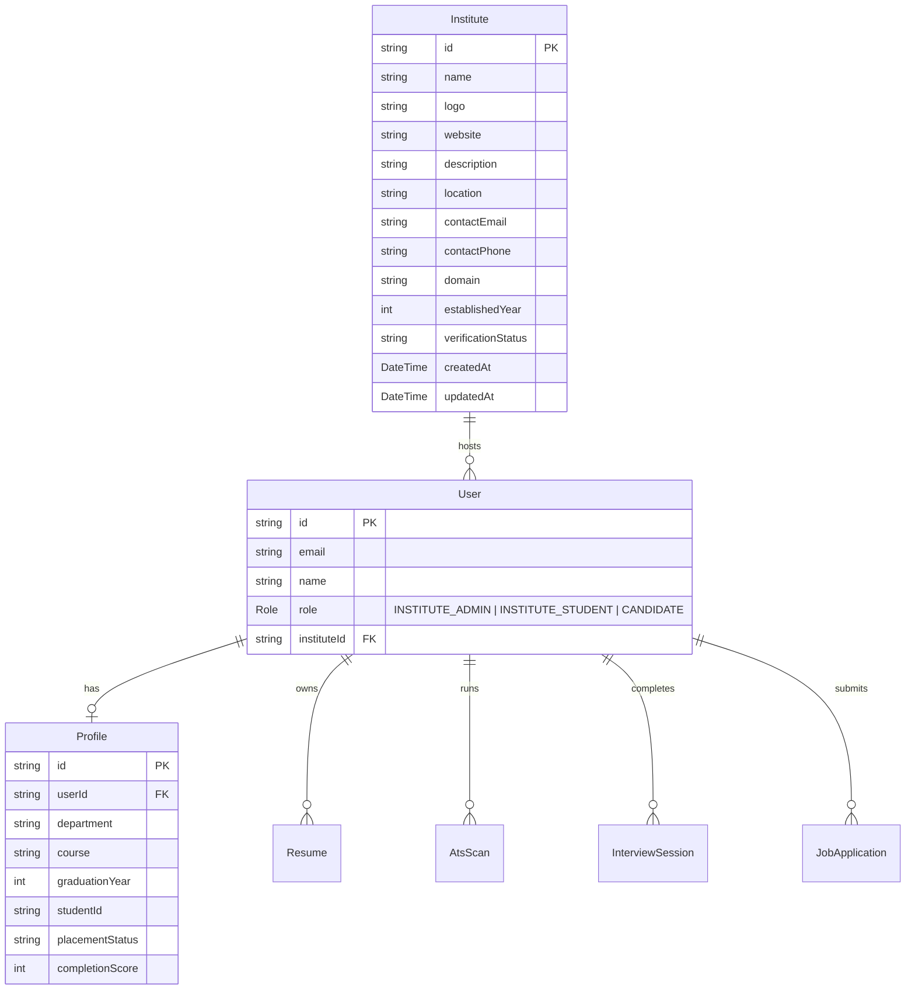

# Vantory / SkillAssociate — Institute Portal Architecture & Technical Specification

This document defines the complete architectural design, authorization security model, multi-tenant isolation principles, API routes, student roster management, placement readiness engine, and reporting framework for the **Institute Portal**.

---

## 1. Executive Overview

The **Institute Portal** is a production-grade campus career-management ecosystem designed for colleges, universities, training institutes, and educational organizations. 

Authorized **Institute Administrators** (`INSTITUTE_ADMIN`) use the portal to:
- Monitor student career readiness, ATS performance, and AI mock interview scores.
- Import student rosters via transactional CSV parsing and validation.
- Track student applications across corporate recruitment pipelines.
- Analyze department-level placement readiness and skills distribution.
- Generate and export institutional placement reports.

---

## 2. Fundamental Product Principles

### 1. Multi-Tenant Data Isolation (P0 Standard)
- Every `/api/institute/*` endpoint MUST resolve `instituteId` strictly from the authenticated user's server-side identity (`requireInstituteAdmin()`).
- The system NEVER trusts client-supplied query parameters (`?instituteId=`), body parameters, URL path parameters, or hidden form fields for authorization.
- Cross-tenant access between Institute A and Institute B is strictly prohibited (returns `403 Forbidden` or `404 Not Found`).

### 2. Candidate Data Ownership & Read-Only Access
- Student candidates own their profiles, resumes, ATS scans, and mock interview histories.
- Institute Admins receive **read-only** visibility into student metrics for career guidance and placement tracking.
- Institute Admins CANNOT edit student resumes, modify ATS/interview scores, alter candidate profiles, or change employer-controlled job application statuses.

### 3. Non-Overlap with Corporate Administration
- `INSTITUTE_ADMIN` permissions are completely decoupled from `COMPANY_ADMIN`.
- Institute Admins cannot edit marketplace job postings, modify employer notes, or manage corporate hiring workflows.

### 4. Deterministic Real Data Only (Zero Fake Statistics)
- All dashboard metrics, readiness funnels, skills matrices, and analytics are calculated directly from real database queries.
- No hardcoded numbers, mock counters, or black-box AI scores are permitted.

### 5. Monochrome Design System
- Strictly adheres to Vantory's Black & White design tokens (`bg-white`, `bg-neutral-950`, `border-neutral-200`, `text-neutral-900`, `text-neutral-500`).
- No colorful accents, gradients, or non-standard glassmorphism.

---

## 3. Database & Entity Relationship Model



---

## 4. API Endpoints Reference

| Endpoint | Method | Role | Description |
| :--- | :--- | :--- | :--- |
| `/api/institute/dashboard` | `GET` | `INSTITUTE_ADMIN` | Institutional summary stats & placement readiness funnel |
| `/api/institute/profile` | `GET`, `PUT` | `INSTITUTE_ADMIN` | Read/update institute organizational profile |
| `/api/institute/students` | `GET` | `INSTITUTE_ADMIN` | Paginated, filtered student roster query |
| `/api/institute/students/import` | `POST` | `INSTITUTE_ADMIN` | Transactional CSV bulk student import |
| `/api/institute/students/[id]` | `GET` | `INSTITUTE_ADMIN` | Detailed candidate profile, resumes, ATS & interview history |
| `/api/institute/jobs` | `GET` | `INSTITUTE_ADMIN` | Read-only campus view of marketplace corporate jobs |
| `/api/institute/applications` | `GET` | `INSTITUTE_ADMIN` | Read-only tracking of campus student job applications |
| `/api/institute/analytics` | `GET` | `INSTITUTE_ADMIN` | Department distribution & skills matrix analytics |
| `/api/institute/reports` | `GET` | `INSTITUTE_ADMIN` | Generates report snapshots and CSV data exports |

---

## 5. Security & Multi-Tenancy Architecture

All institute server actions & API routes use `requireInstituteAdmin()`:

```typescript
// Authorization Resolution Pattern
const user = await requireInstituteAdmin(); // Verifies session token & INSTITUTE_ADMIN / SUPER_ADMIN role
const { institute } = await getOrCreateInstituteProfile(user.id); // Resolves server-side instituteId
const instituteId = institute.id; // Single source of truth for queries
```

Attempts to manipulate `instituteId` via client requests fail automatically because the query filters strictly by the resolved `instituteId`.
